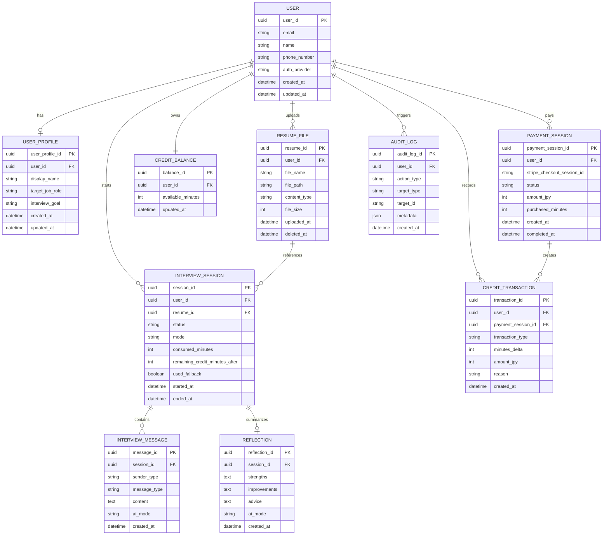

# AI面接コーチ ER図

## 1. 文書概要

### 1.1 目的
本書は、AI面接コーチの主要データ構造とエンティティ間の関係を整理するものである。基本設計書のデータ設計を補完し、DB 設計、API 設計、実装時の参照資料として利用する。

### 1.2 対象範囲
- ユーザー情報
- 職務経歴書情報
- 面接セッション情報
- メッセージ情報
- 振り返り情報
- クレジット、課金情報
- 監査ログ

## 2. ER図

## 3. エンティティ概要

### 3.1 USER
- ユーザーの基本情報を保持する
- 認証方式と連携し、メールアドレスや電話番号を管理する

### 3.2 USER_PROFILE
- ユーザーの面接準備に関する補足情報を保持する
- 将来的なパーソナライズ用設定拡張を想定する

### 3.3 RESUME_FILE
- アップロードした職務経歴書を管理する
- セッション開始時の参照元として利用する
- 実体ファイルは Amazon S3 に保存し、本エンティティでは S3 上の参照情報を管理する

### 3.4 INTERVIEW_SESSION
- 面接練習の単位となるエンティティである
- 利用時間、状態、フォールバック利用有無を保持する

### 3.5 INTERVIEW_MESSAGE
- 面接中の会話履歴を保持する
- ユーザー発話と AI 応答の両方を記録する

### 3.6 REFLECTION
- 練習後の振り返り内容を保持する
- 良かった点、改善点、次回アドバイスを保存する

### 3.7 CREDIT_BALANCE
- 現時点の利用可能時間を保持する
- 高速参照用の集計値として扱う

### 3.8 CREDIT_TRANSACTION
- クレジットの付与、消費、調整履歴を保持する
- 課金整合性と監査対応の基礎とする

### 3.9 PAYMENT_SESSION
- Stripe Checkout セッションの結果を保持する
- 決済ステータスと購入量の管理に利用する

### 3.10 AUDIT_LOG
- 主要操作の証跡を保持する
- 障害調査、セキュリティ監査に利用する

## 4. 主なリレーション
| 親 | 子 | 関係 | 説明 |
| --- | --- | --- | --- |
| `USER` | `RESUME_FILE` | 1対多 | 1ユーザーが複数の職務経歴書を持つ |
| `USER` | `INTERVIEW_SESSION` | 1対多 | 1ユーザーが複数の練習セッションを持つ |
| `INTERVIEW_SESSION` | `INTERVIEW_MESSAGE` | 1対多 | 1セッションに複数のメッセージが紐付く |
| `INTERVIEW_SESSION` | `REFLECTION` | 1対1 に近い | 1セッションにつき1件の振り返りを基本とする |
| `USER` | `CREDIT_TRANSACTION` | 1対多 | クレジット増減履歴を保持する |
| `PAYMENT_SESSION` | `CREDIT_TRANSACTION` | 1対多 | 1回の決済から複数の調整履歴が発生し得る |

## 5. 設計上の注意点
- `CREDIT_BALANCE` は参照高速化のための現在値であり、正本は `CREDIT_TRANSACTION` とする
- `INTERVIEW_SESSION.used_fallback` により AI フォールバック利用有無を判定可能にする
- `REFLECTION.ai_mode` と `INTERVIEW_MESSAGE.ai_mode` により通常応答か簡易応答かを追跡する
- `RESUME_FILE.deleted_at` を持たせ、論理削除を選択可能にする
- `RESUME_FILE.file_path` には S3 オブジェクトキーを保持し、実ファイル本体は DB に格納しない
- 電話番号重複禁止は `USER.phone_number` の一意制約または同等制御で実現する
