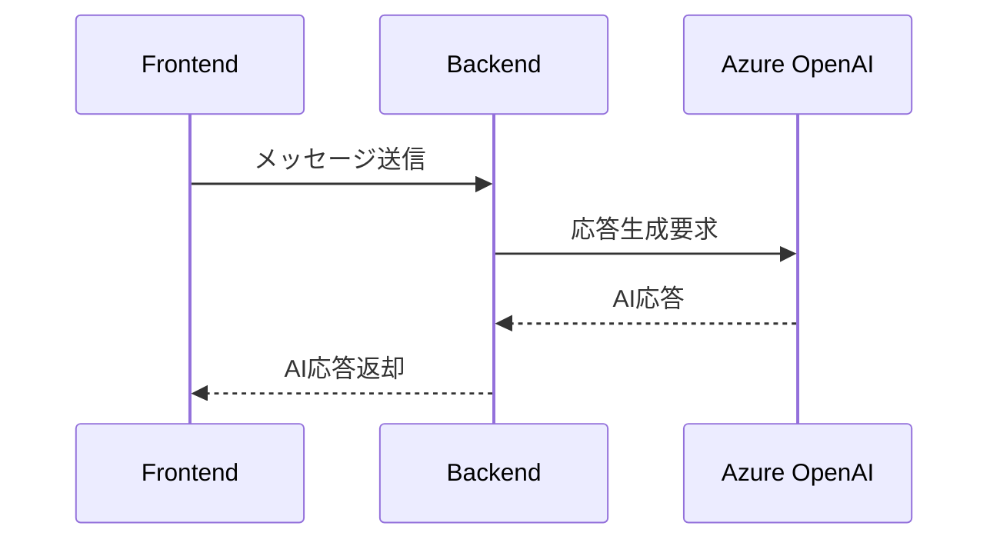
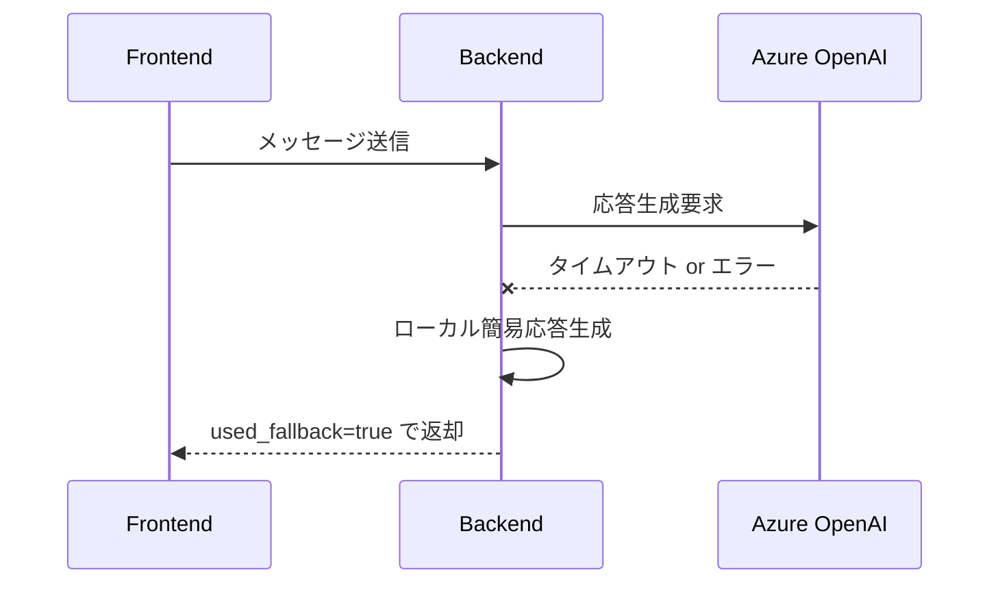
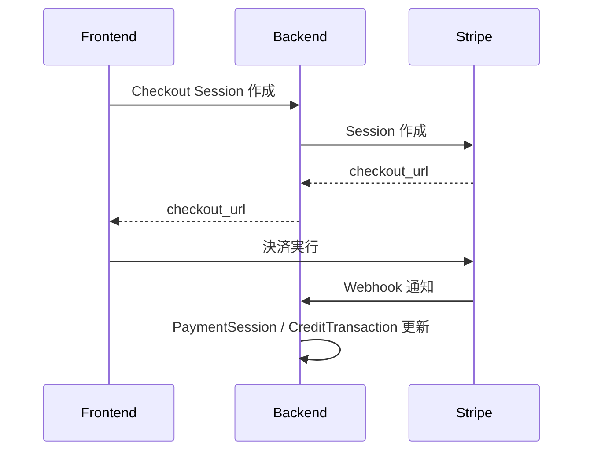

# AI面接コーチ 外部連携設計書

## 1. 文書概要

### 1.1 目的
本書は、AI面接コーチが利用する外部サービスとの接続方式、責務分担、失敗時挙動、運用上の考慮点を整理するものである。

### 1.2 対象連携
- Azure OpenAI
- Amazon Cognito
- Stripe
- Amazon S3

### 1.3 実装前提
- AWS で新規に作成するリソースは AWS CDK で管理する
- データベースは既存環境を利用し、このプロジェクトでは新規作成しない

## 2. 外部連携一覧
| 連携先 | 主用途 | 実行主体 |
| --- | --- | --- |
| Azure OpenAI Realtime API | 面接対話、振り返り生成 | Backend |
| Amazon Cognito | 本番認証 | Frontend / Backend |
| Stripe Checkout Sessions | 追加課金 | Frontend / Backend |
| Amazon S3 | 職務経歴書ファイル保存 | Backend |

## 3. Azure OpenAI 連携

### 3.1 用途
- 面接中の AI 応答生成
- セッション終了後の振り返り生成
- 必要に応じたリアルタイム会話支援

### 3.2 連携方式
- バックエンドが Azure OpenAI API を呼び出す
- フロントエンドは Azure に直接アクセスしない
- API キー、エンドポイント、デプロイ名はサーバー側環境変数で管理する

### 3.3 障害時方針
- タイムアウト、接続失敗、レート制限時はローカル簡易応答へフォールバックする
- レスポンスには `used_fallback` もしくは `ai_mode` を含める
- フロントエンドは簡易応答モードであることを明示する

### 3.4 リトライ方針
- 同一リクエストの無制限リトライは行わない
- 一時的エラー時のみ限定的に再試行する
- セッション系 API では重複応答を避けるため冪等性に注意する

## 4. Cognito 連携

### 4.1 用途
- 本番環境のログイン認証
- JWT 発行
- ログアウト導線提供

### 4.2 連携方式
- フロントエンドが Hosted UI または Auth SDK でログインする
- JWT をフロントエンドからバックエンドへ送信する
- バックエンドは JWT の署名、有効期限、audience、issuer を検証する
- Cognito の新規構成は AWS CDK で管理する

### 4.3 失敗時挙動
- トークン未送信、期限切れ、不正署名時は `401`
- 権限不足時は `403`
- UI は再ログイン導線を表示する

## 5. Stripe 連携

### 5.1 用途
- クレジット追加購入
- 決済完了状態の反映

### 5.1.1 MVP 課金プラン
- `minutes_30` の単一プランとする
- 30 分あたり 300 円とする

### 5.2 連携方式
- バックエンドが Checkout Session を作成する
- フロントエンドは返却された Checkout URL に遷移する
- Stripe Webhook を受信し、決済結果を確定反映する

### 5.3 整合性方針
- クレジット加算は Webhook または決済確定確認を基準に反映する
- 決済成功の重複通知に備え、冪等性を担保する
- `PaymentSession` と `CreditTransaction` の両方に記録を残す

### 5.4 失敗時挙動
- セッション作成失敗時は課金画面にエラー表示する
- 決済未完了時は残高反映しない
- Webhook 処理失敗時はリトライ可能な構成にする

## 6. Amazon S3 連携

### 6.1 用途
- 職務経歴書ファイルの保管

### 6.2 連携方式
- バックエンドがファイルを受け取り S3 に保存する
- DB には S3 オブジェクトキーなどのメタ情報のみ保存する
- 必要時はバックエンドが認可後に取得処理を行う
- S3 バケットの新規作成、ポリシー設定、暗号化設定は AWS CDK で管理する

### 6.3 保存方針
- オブジェクトキーはユーザー単位、ファイル単位で一意化する
- 例: `resumes/{user_id}/{resume_id}/resume.pdf`
- 公開バケットは利用せず、非公開アクセスを前提とする
- 許可ファイル形式は PDF のみ、サイズ上限は 10MB とする

### 6.4 セキュリティ
- 署名付き URL を必要に応じて発行する
- アップロード時に MIME type とサイズ制限を検証する
- 将来的にウイルススキャン導入を検討する
- 論理削除後の S3 実体削除は即時実施せず、後続の運用ジョブで削除する

## 6.5 AI フォールバック時の課金方針
- フォールバック応答のみで完了したセッションは課金対象外とする
- 通常 AI 応答とフォールバック応答が混在する場合の扱いは将来拡張とし、MVP では非課金扱いを基本とする

## 7. 外部連携シーケンス

### 7.1 面接対話

### 7.2 面接対話フォールバック

### 7.3 課金

## 8. タイムアウト・リトライ方針
| 連携先 | タイムアウト方針 | リトライ方針 |
| --- | --- | --- |
| Azure OpenAI | 短めに設定 | 一時エラーのみ限定再試行 |
| Cognito | JWT 検証中心のため通信依存を減らす | 原則なし |
| Stripe | API 作成時は適切なタイムアウト設定 | 冪等性キーを前提に限定再試行 |
| S3 | アップロード時はサイズに応じて設定 | 通信断時のみ再試行 |

## 9. 監視・運用
- Azure OpenAI エラー率を監視する
- Stripe Webhook 失敗件数を監視する
- S3 アップロード失敗を監視する
- Cognito 認証失敗率を監視する
- 障害時に影響範囲を追えるよう request_id をログへ含める

## 10. Cloud Run 起動遅延への対応

### 10.1 前提
- バックエンドは Cloud Run 上で動作するため、無通信期間後の初回リクエストではコールドスタートが発生し得る
- 面接開始や初回メッセージ送信の体感速度に影響しやすい

### 10.2 対応方針
- Cloud Run の最小インスタンス数は 0 を前提とし、コールドスタートを許容した設計とする
- アプリ起動時の重い初期化を避け、外部クライアント生成は必要時に行う
- ヘルスチェック用エンドポイントを用意し、起動確認を容易にする
- フロントエンドでは初回応答待ちを考慮したローディング表示を行う
- タイムアウト値は Cloud Run 起動遅延を含めて調整する

### 10.3 特に影響を受ける処理
- `POST /api/interview-sessions`
- `POST /api/interview-sessions/{session_id}/messages`
- `POST /api/interview-sessions/{session_id}/reflection`
- `POST /api/billing/checkout-sessions`
