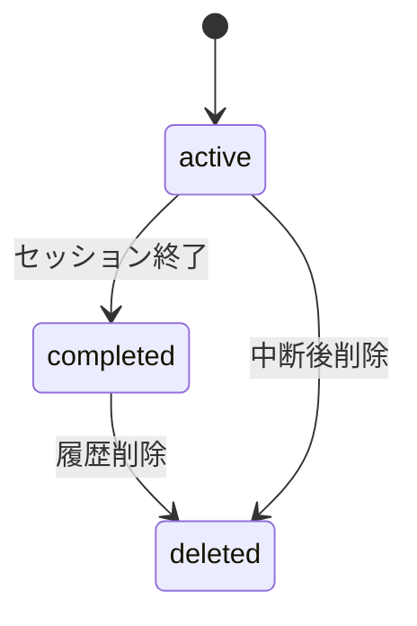
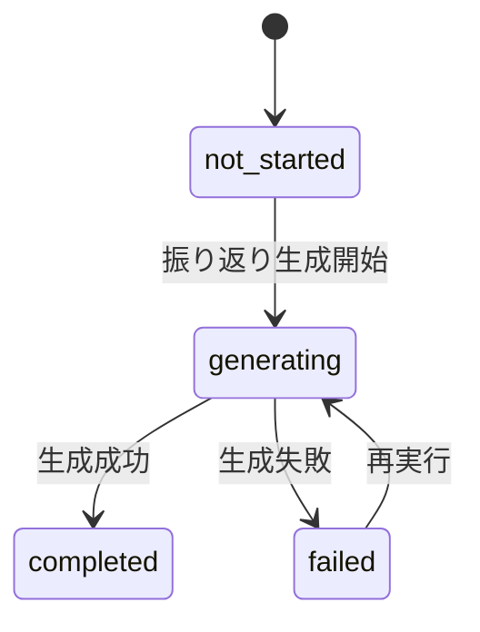
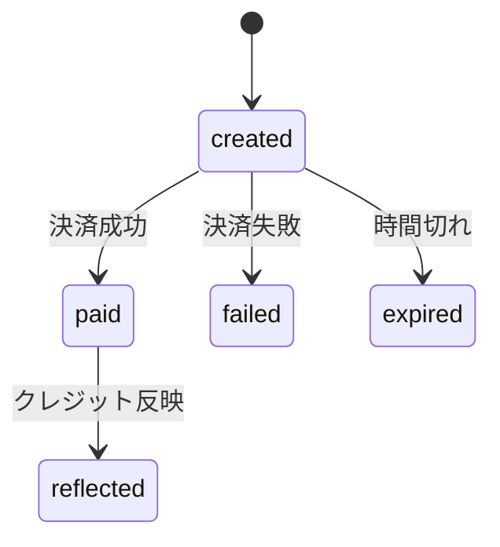
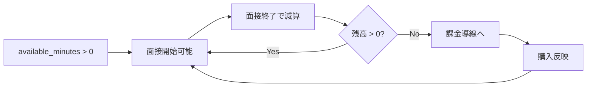
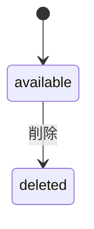

# AI面接コーチ 状態遷移設計書

## 1. 文書概要

### 1.1 目的
本書は、AI面接コーチにおける主要業務オブジェクトの状態遷移を定義するものである。面接セッション、課金決済、クレジット残高、職務経歴書管理に関する状態変化と遷移条件を明確化し、実装時の整合性を担保する。

### 1.2 対象
- 面接セッション
- 振り返り生成
- 決済セッション
- クレジット残高
- 職務経歴書

## 2. 状態遷移設計の基本方針
- 状態は DB 上の値として一意に判定できるようにする
- 不正な状態遷移は API レベルで拒否する
- 課金、クレジット、セッション終了は監査可能な履歴を残す
- 外部連携失敗時は再試行可能な中間状態を許容する

## 3. 面接セッション状態遷移

### 3.1 状態一覧
| 状態 | 説明 |
| --- | --- |
| `active` | 面接中 |
| `completed` | 正常終了 |
| `deleted` | ユーザー削除済み |

### 3.2 遷移図

### 3.3 遷移条件
| 現状態 | イベント | 次状態 | 条件 |
| --- | --- | --- | --- |
| なし | セッション開始 | `active` | クレジット残高あり、認証済み |
| `active` | セッション終了 | `completed` | 消費時間確定、残高更新成功 |
| `completed` | 履歴削除 | `deleted` | 本人所有リソース |
| `active` | 履歴削除 | `deleted` | 中断扱いを許容する場合のみ |

### 3.4 実装上の注意点
- `completed` への遷移は `CreditTransaction` 記録と同一トランザクションで行う
- `deleted` は論理削除を基本とし、一覧表示対象から除外する
- `active` 状態のまま長時間放置されたセッションは将来的にタイムアウト終了を検討する

## 4. 振り返り生成状態

### 4.1 状態一覧
| 状態 | 説明 |
| --- | --- |
| `not_started` | 未生成 |
| `generating` | 生成中 |
| `completed` | 生成完了 |
| `failed` | 生成失敗 |

### 4.2 遷移図

### 4.3 遷移条件
| 現状態 | イベント | 次状態 | 条件 |
| --- | --- | --- | --- |
| `not_started` | 振り返りAPI実行 | `generating` | 対象セッションが `completed` |
| `generating` | AI応答取得 | `completed` | 保存成功 |
| `generating` | AI失敗 | `failed` | フォールバックも含め失敗 |
| `failed` | 再生成 | `generating` | 本人再試行 |

### 4.4 実装上の注意点
- MVP では非同期ジョブ化せず同期生成でもよいが、状態管理は残す
- フォールバック生成成功時も `completed` とし、`ai_mode=fallback` を保持する

## 5. 決済セッション状態遷移

### 5.1 状態一覧
| 状態 | 説明 |
| --- | --- |
| `created` | Checkout Session 作成済み |
| `paid` | 決済成功 |
| `failed` | 決済失敗 |
| `expired` | 有効期限切れ |
| `reflected` | クレジット反映済み |

### 5.2 遷移図

### 5.3 遷移条件
| 現状態 | イベント | 次状態 | 条件 |
| --- | --- | --- | --- |
| なし | Checkout Session 作成 | `created` | Stripe Session 作成成功 |
| `created` | Webhook success | `paid` | 署名検証、重複排除済み |
| `created` | Webhook failure | `failed` | Stripe 側失敗確定 |
| `created` | 有効期限経過 | `expired` | 未決済のまま期限切れ |
| `paid` | 残高加算成功 | `reflected` | `CreditTransaction` 作成成功 |

### 5.4 実装上の注意点
- `paid` と `reflected` を分けることで、決済成功後の残高反映失敗を追跡可能にする
- `reflected` への遷移は冪等に実装する
- 同一 `stripe_checkout_session_id` の重複反映を禁止する

## 6. クレジット残高状態

### 6.1 基本方針
- クレジット残高は状態値というより集計結果として扱う
- 正本は `credit_transactions` とし、`credit_balances` は参照高速化用とする

### 6.2 残高イベント
| イベント | 変化 |
| --- | --- |
| 初期付与 | 加算 |
| 課金購入 | 加算 |
| 面接利用終了 | 減算 |
| 管理者調整 | 増減 |

### 6.3 遷移イメージ

### 6.4 実装上の注意点
- 残高更新はトランザクション内で行う
- マイナス残高を許容しない
- 面接開始時点では仮引き落としせず、MVP では終了時点確定を基本とする

## 7. 職務経歴書状態

### 7.1 状態一覧
| 状態 | 説明 |
| --- | --- |
| `available` | 利用可能 |
| `deleted` | 論理削除済み |

### 7.2 遷移図

### 7.3 実装上の注意点
- `deleted` は論理削除とし、S3 実体削除は非同期または運用ジョブでもよい
- 面接セッションで参照中の RESUME を削除する場合の扱いは詳細設計で統一する

## 8. 遷移制御の重点ポイント
- `interview_sessions.status` は `active` の時だけメッセージ追加可能
- `reflections` は `completed` セッションに対してのみ生成可能
- `payment_sessions.status=reflected` 以降は二重加算禁止
- `resume_files.deleted_at` が入っているファイルは新規セッション開始時に選択不可
