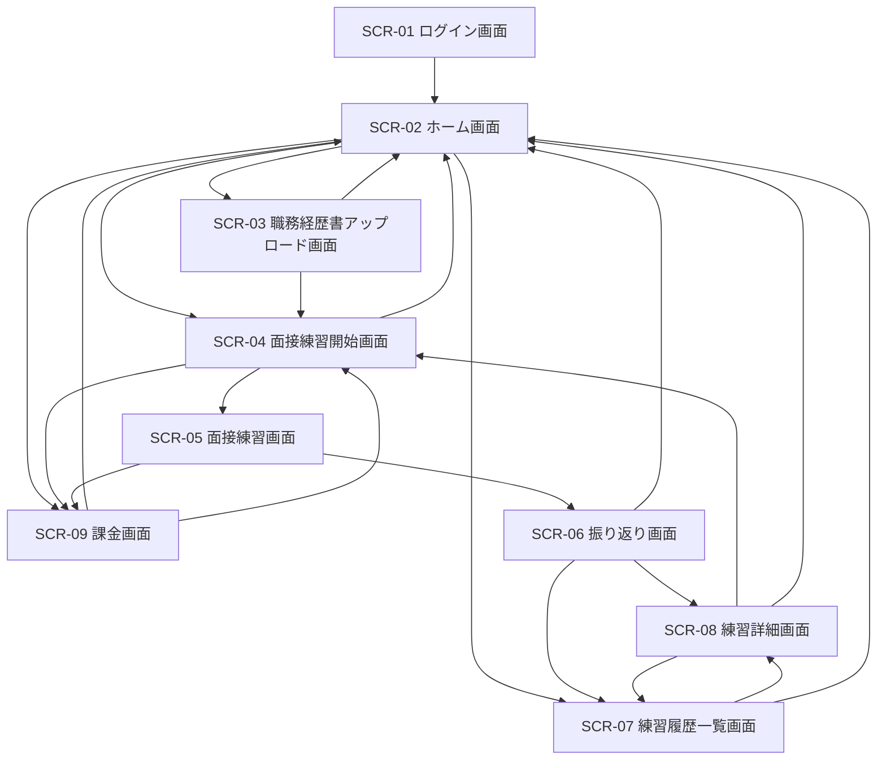
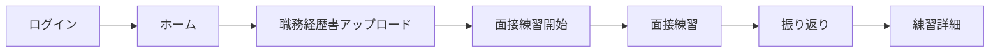
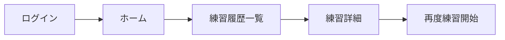
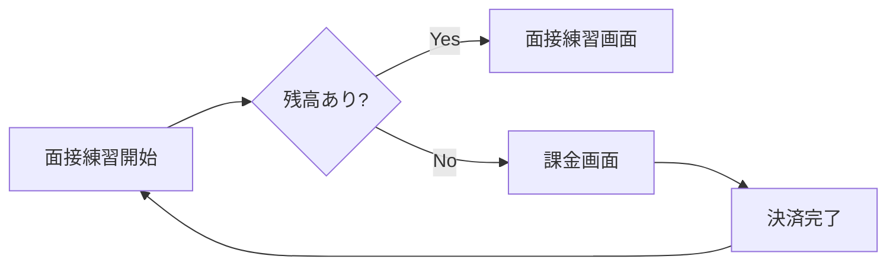

# AI面接コーチ 画面遷移図

## 1. 文書概要

### 1.1 目的
本書は、AI面接コーチにおける主要画面の遷移と利用シナリオを整理するものである。基本設計書に定義した画面一覧を補完し、ユーザー導線と機能配置を明確化する。

### 1.2 対象画面
- ログイン画面
- ホーム画面
- 職務経歴書アップロード画面
- 面接練習開始画面
- 面接練習画面
- 振り返り画面
- 練習履歴一覧画面
- 練習詳細画面
- 課金画面

## 2. 画面一覧
| 画面ID | 画面名 | 主な目的 |
| --- | --- | --- |
| `SCR-01` | ログイン画面 | 認証方式の選択とログイン |
| `SCR-02` | ホーム画面 | 利用状況確認と主要機能への導線 |
| `SCR-03` | 職務経歴書アップロード画面 | 職務経歴書の登録と一覧確認 |
| `SCR-04` | 面接練習開始画面 | 練習条件設定と開始 |
| `SCR-05` | 面接練習画面 | AI との面接対話 |
| `SCR-06` | 振り返り画面 | 面接結果のフィードバック確認 |
| `SCR-07` | 練習履歴一覧画面 | 過去履歴の一覧参照 |
| `SCR-08` | 練習詳細画面 | セッション内容、メッセージ、振り返り確認 |
| `SCR-09` | 課金画面 | クレジット購入 |

## 3. 全体画面遷移図

## 4. 主な画面遷移シナリオ

### 4.1 初回利用シナリオ

### 4.2 継続利用シナリオ

### 4.3 クレジット不足時シナリオ

## 5. 画面別概要

### 5.1 SCR-01 ログイン画面
- 目的: デモ認証または本番認証でログインする
- 主な要素:
  - デモログインボタン
  - Cognito ログイン導線
  - 利用説明
- 遷移先:
  - ホーム画面

### 5.2 SCR-02 ホーム画面
- 目的: 現在の利用状況と主要機能への入口を提供する
- 主な要素:
  - 残クレジット表示
  - 最近の練習履歴
  - 練習開始導線
  - 職務経歴書管理導線
  - 課金導線

### 5.3 SCR-03 職務経歴書アップロード画面
- 目的: 職務経歴書ファイルの追加、確認、削除を行う
- 主な要素:
  - ファイル選択
  - アップロード結果表示
  - 登録済み一覧

### 5.4 SCR-04 面接練習開始画面
- 目的: 練習対象の職務経歴書や面接条件を選択する
- 主な要素:
  - 職務経歴書選択
  - 面接モード選択
  - 開始ボタン
  - 残クレジット確認

### 5.5 SCR-05 面接練習画面
- 目的: AI と対話しながら面接練習を行う
- 主な要素:
  - 会話表示領域
  - 音声またはテキスト入力
  - AI メッシュ演出
  - 経過時間表示
  - 終了ボタン
- 備考:
  - AI 障害時は簡易応答モードを表示する

### 5.6 SCR-06 振り返り画面
- 目的: 良かった点、改善点、次回アドバイスを確認する
- 主な要素:
  - 良かった点
  - 改善点
  - 次回アドバイス
  - 詳細表示導線

### 5.7 SCR-07 練習履歴一覧画面
- 目的: 過去の練習セッションを時系列で確認する
- 主な要素:
  - 履歴一覧
  - 削除導線
  - 詳細遷移

### 5.8 SCR-08 練習詳細画面
- 目的: 面接内容、メッセージ、振り返りをまとめて確認する
- 主な要素:
  - セッション情報
  - 会話履歴
  - 振り返り
  - 再練習導線

### 5.9 SCR-09 課金画面
- 目的: クレジットを追加購入する
- 主な要素:
  - プラン表示
  - 購入ボタン
  - Stripe Checkout 遷移
  - 決済結果表示

## 6. 遷移設計上の注意点
- 未認証時は保護画面へ直接遷移させず、ログイン画面にリダイレクトする
- クレジット不足時は面接練習開始前に課金画面へ誘導する
- 面接練習中のブラウザ離脱には確認ダイアログを表示する
- 振り返り生成中はローディング状態を明示する
- AI フォールバック時は通常モードとの差異をユーザーに明示する
