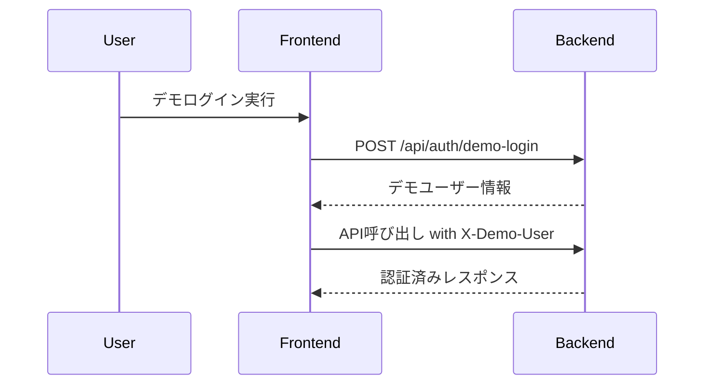
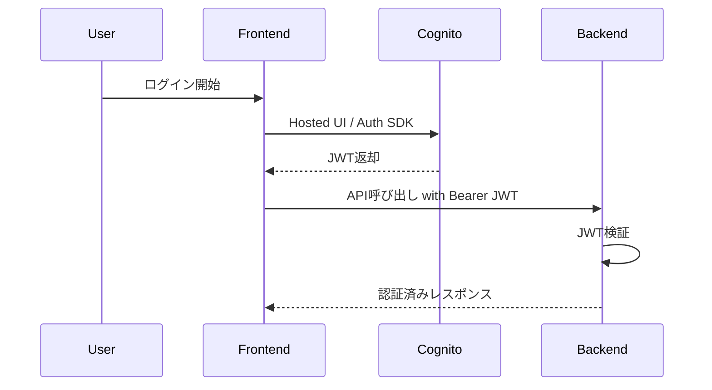

# AI面接コーチ 認証・認可設計書

## 1. 文書概要

### 1.1 目的
本書は、AI面接コーチにおける認証、認可、ユーザー識別、セッション管理の方針を定義するものである。開発用デモ認証と本番用 Cognito 認証の切り替え、および API 保護の方式を整理し、実装時の判断基準を提供する。

### 1.2 対象範囲
- 開発用デモ認証
- 本番用 Cognito 認証
- JWT 検証
- API 認可
- ユーザー識別
- 管理系 API へのアクセス制御

## 2. 認証方針

### 2.1 基本方針
- 開発環境では迅速な検証を目的としてデモ認証を利用する
- 本番環境では Amazon Cognito による認証を利用する
- バックエンド API は認証アダプタを介して認証方式を吸収する
- フロントエンドは認証結果に応じて Bearer トークンまたはデモヘッダーを送信する

### 2.2 認証方式一覧
| 環境 | 認証方式 | 送信情報 | 備考 |
| --- | --- | --- | --- |
| 開発 | Demo Auth | `X-Demo-User` | ローカル開発用 |
| 本番 | Amazon Cognito | `Authorization: Bearer <JWT>` | Hosted UI または Amplify Auth 想定 |

## 3. 認証フロー

### 3.1 開発用デモ認証


### 3.2 本番用 Cognito 認証


## 4. 認証アダプタ設計

### 4.1 構成方針
- バックエンドは直接認証方式を分岐せず、認証アダプタ経由でユーザー情報を取得する
- アダプタは共通の `AuthenticatedPrincipal` を返す
- 認証失敗時は一律で `401 Unauthorized` を返す

### 4.2 想定インターフェース
```python
class AuthenticatedPrincipal:
    user_id: str
    email: str | None
    auth_provider: str
    roles: list[str]

class AuthAdapter:
    def authenticate(self, request) -> AuthenticatedPrincipal:
        raise NotImplementedError
```

### 4.3 実装候補
- `DemoAuthAdapter`
- `CognitoJwtAuthAdapter`

## 5. 認可設計

### 5.1 ロール定義
| ロール | 説明 |
| --- | --- |
| `user` | 一般利用者 |
| `admin` | 運営、監査、障害確認を行う管理者 |

### 5.2 アクセス制御方針
- 一般ユーザーは自分自身のリソースのみ参照、更新可能とする
- 管理者は監査ログ、ヘルスチェック、管理用途 API にアクセス可能とする
- 管理系 API 以外でも、他ユーザーのリソース参照は禁止する

### 5.3 認可マトリクス
| APIカテゴリ | user | admin |
| --- | --- | --- |
| `/api/auth/*` | 可 | 可 |
| `/api/users/me` | 可 | 可 |
| `/api/resumes/*` | 自分のみ可 | 可 |
| `/api/interview-sessions/*` | 自分のみ可 | 可 |
| `/api/history/*` | 自分のみ可 | 可 |
| `/api/credits/*` | 自分のみ可 | 可 |
| `/api/billing/*` | 自分のみ可 | 可 |
| `/api/admin/*` | 不可 | 可 |

## 6. ユーザー識別設計

### 6.1 基本方針
- アプリケーション内部の主キーは `user_id` を利用する
- 外部認証基盤の識別子は別途紐付け情報として保持する
- メールアドレスは変更可能な属性として扱う
- 電話番号は一意性制御対象とする

### 6.2 識別情報
| 項目 | 用途 |
| --- | --- |
| `user_id` | アプリケーション内部主キー |
| `auth_provider` | `demo` または `cognito` |
| `external_subject` | Cognito の subject 等 |
| `email` | ログイン後の連絡先属性 |
| `phone_number` | 重複禁止の本人識別補助 |

## 7. トークン検証設計

### 7.1 JWT 検証項目
- 署名検証
- issuer 検証
- audience 検証
- 有効期限検証
- トークン種別検証

### 7.2 エラー時の扱い
| 事象 | レスポンス |
| --- | --- |
| トークンなし | `401` |
| 署名不正 | `401` |
| 期限切れ | `401` |
| audience 不一致 | `401` |
| 権限不足 | `403` |

## 8. セッション管理

### 8.1 方針
- フロントエンドはトークンを保持し API ごとに送信する
- バックエンド側ではサーバーセッションを前提としない
- ログアウト時はフロントエンド上の認証情報を破棄する
- Cognito ログアウト時は Hosted UI 側のログアウト導線を利用する

## 9. セキュリティ要件

### 9.1 基本対策
- HTTPS を強制する
- 個人情報は必要最小限のみ返却する
- ログ出力時は Bearer トークンを記録しない
- 電話番号、メールアドレスのマスキングを考慮する
- 管理系 API は明示ロール必須とする

### 9.2 将来拡張
- パスキー認証追加
- 電話番号認証導入
- パスワードリセットフロー追加
- MFA 追加

## 10. 実装上の注意点
- デモ認証ロジックが本番に混入しないよう環境変数で明示制御する
- JWT 検証失敗理由は詳細を返しすぎず、ログ側にのみ詳細を残す
- 権限チェックはビュー層だけでなくサービス層でも再確認する
- 管理者ロール判定のソースを Cognito claim または DB のどちらに寄せるかは詳細設計で統一する
